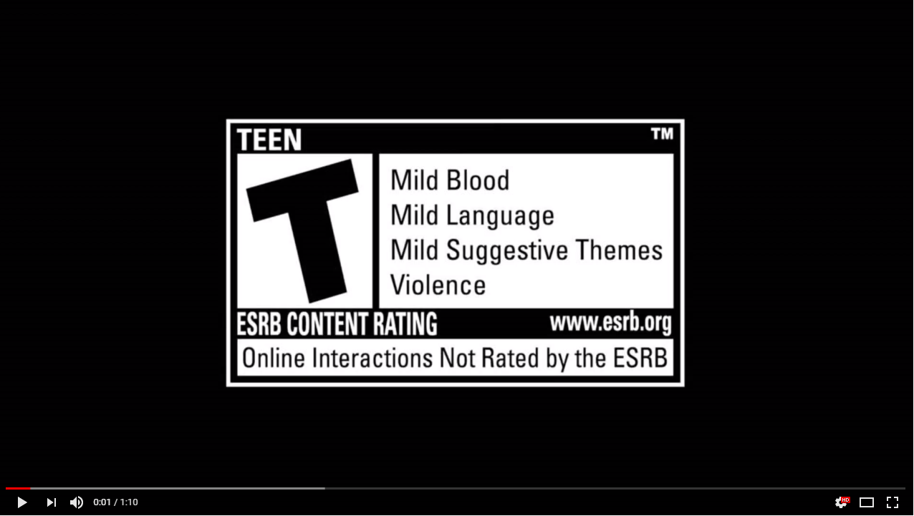

# MSc Projects

## 42 Pieces of Story
This game had an initial version created during the classes of Game Design and a second and final one created during the classes of Game Development and Methodology. In the first version, you are a young men who wakes up in a village burning down and you hear the screams of a little girl. You don't recall anything about who you are, where you are and what has happened with you, and your only companion on your Journey is a shape shifting weapon that is with you when you wake up and it is able to talk to you. 

    
    

    
    

    
    

In the second version, you are a young man living a quiet life in your small peacefull village, when suddenly everything changes. You wake up to a destroyed land where there used to be so much life. You begin your journey to try and rebuild your village, helping others and fnding out who turn your home into a hellish place.

  

## Touch on Chemistry - Game to teach Organic Chemistry
This is the final project of my MSc, it is a game to teach Organic Chemistry to highschool students that uses Virtual Reality technology and the Leap Motion sensor. The player is immersed in a virtual world where he can grab atoms with his own hands and create and manipulate molecules.

The game is based on what the students need to learn in highschool and it has several challenges such as, creating molecules from scratch, transform a molecule from a functional group into another, complete a partially built molecule knowing what it's struture is and answering different questions about the molecules.

  

