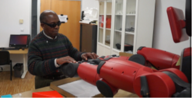

# Latest News

## Poster MobileHCI 2018 !
**AidMe: Interactive Non-Visual Smartphone Tutorials**

AidMe is a system-wide authoring and playthrough of non-visual interactive tutorials. Tutorials are created via user demonstration and narration. We relied on AidMe to conduct a preliminary study with 11 blind participants gaining insights into the development of accessible interactive non-visual tutorials. [PDF](./pub/mobilehci18_aidme.pdf)

## Paper ASSETS 2018 =)
**What My Eyes Can’t See, A Robot Can Show Me: Exploring the Collaboration Between Blind People and Robots**

In this paper, we explore how assistive robots can go beyond information-giving assistive technologies (e.g., screen readers)by physically collaborating with blind people in an assembly task. [PDF](./pub/assets18_robot.pdf)

